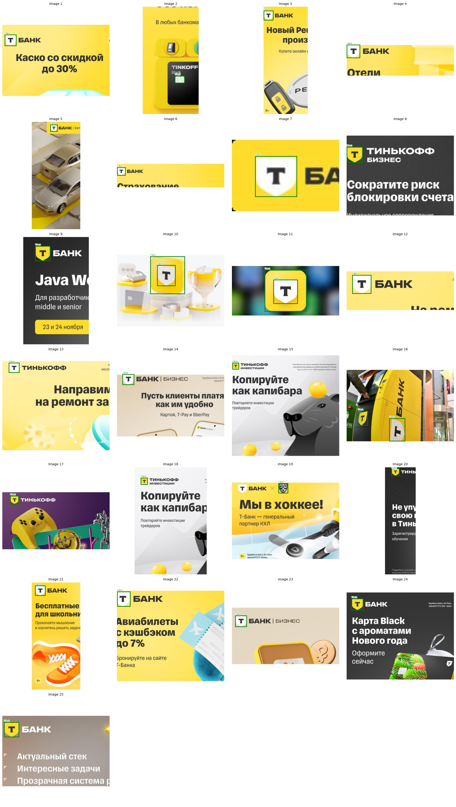

# Детекция логотипа Т-Банка.

Решение для кейса CV "Детекция логотипа Т-Банка" 
**Автор**: Анна Губина
**Дата**: Сентябрь 2025  

---

## Цель кейса

Создать REST API сервис, который:
- Обнаруживает логотип Т-Банка (стилизованная буква "Т" в щите) на изображениях.
- Игнорирует логотипы "Тинькофф", "Роснефть" и другие посторонние объекты.
- Возвращает координаты найденных логотипов в формате `BoundingBox`.
- Работает **не более чем 10 секунд на изображение**.
- Поддерживает форматы: JPEG, PNG, BMP, WEBP.
- Доступен по порту 8000.

API соответствует контракту и упакован в Docker-контейнер.

---

##  Подход к решению

### 2. Этап 1: Grounding DINO — генерация кандидатов

Использована модель **`IDEA-Research/grounding-dino-base`** — современная архитектура для zero-shot детекции, сочетающая DINO и текстовый энкодер.

- **Промт**: `"shield-formed logo"`  
  (выбран после экспериментов: короткие промты дают лучшее обобщение).
- **Порог уверенности**: `0.35` — баланс между полнотой и шумом.
- **Результат**: 29 000 изображений с кандидатами на логотип.

>  Официальная документация: [Hugging Face — Grounding DINO](https://huggingface.co/docs/transformers/model_doc/grounding-dino)

---

### 3. Этап 2: Фильтрация по геометрии и цвету

После DINO применены **два уровня фильтрации**:

####  Геометрия:
- Отношение сторон:  
  - `0.6 ≤ aspect ≤ 1.5` — для стандартных объектов.  
  - `0.8 ≤ aspect ≤ 1.25` — для крупных объектов (>25% площади изображения).
- Минимальная площадь: `0.04%` от общего размера.
- Максимальная площадь: `25%` — исключает фоновые элементы.

####  Цвет (функция `is_shield_color()`):
Анализируется цвет центральной части обрезанного бокса:
- **Светлый щит**: `R, G > 160`, разница между каналами < 40.
- **Жёлтый щит**: `R, G высокие`, `B < R - 50`.
- **Тёмный щит**: `R, G, B < 50`, разница < 30.

**Результат**: 11 546 изображений прошли фильтрацию.

---

### 4. Этап 3: CLIP — финальная валидация

Использован **CLIP (ViT-B/32)** для семантической проверки:
- **Позитивные эталоны**: 10 изображений логотипа Т-Банка (разные ракурсы, цвета).
- **Негативные эталоны**: логотипы "Тинькофф", "Роснефть", случайные объекты.
- **Порог схожести**: `0.25` — если `sim_pos > sim_neg` и `sim_pos > 0.25`, бокс сохраняется.

> Это позволило отсеять 7 797 ложных срабатываний.

**Результат**: 3 477 изображений с подтверждёнными логотипами.

---

### 5. Этап 4: Ручная проверка и постобработка

Хотя разметка была автоматической, **все изображения, прошедшие CLIP, были визуально проверены**:

- Удалены оставшиеся ложные срабатывания.
- В редких случаях были добавлены отсутсвующие bboxы.

>  Это обеспечило **высокое качество разметки**, несмотря на автоматический пайплайн.

---

### 6. Создание датасета YOLO

На основе отфильтрованных данных создан датасет в формате YOLOv8:
- Координаты: `(xc, yc, w, h)` — нормализованы по размеру изображения.
- Класс: `t-bank` (ID: 0).
- Все изображения сохранены в `yolo_dataset/images/`, разметка — в `yolo_dataset/labels/`.

**Разделение**:
- **Train**: 2 782 изображений (80%).
- **Valid**: 695 изображений (20%).


---

### 7. Обучение модели

Использована **YOLOv8s** — оптимальный выбор по точности/скорости.

**Параметры обучения**:
- Размер входа: `640x640`.
- Epochs: `15`.
- Batch: `16`.
- Порог уверенности: `0.4`.
- Ранняя остановка: `patience=5` (чтобы избежать переобучения).
- Оптимизатор: SGD с momentum.
- Learning rate: 0.01.

**Результат**:
- Обучение завершено за ~12 минут на GPU T100.
- Модель сохранена: `weights/best.pt`.

---

### 8. Валидационный набор

Создан отдельный набор для оценки качества:
- **695 изображений** — те же, что в `valid` Roboflow.
- Разметка — результат автоматической системы + ручная проверка.
- Включает:
  - Логотипы в сложных условиях (под углом, в тени).
  - Изображения без логотипа (для оценки ложных срабатываний).

>  Выложен в репозитории: `validation-dataset/`

---

### 9. Метрики качества

Оценка на валидационной выборке (IoU=0.5):

Precision: 0.984
 Recall:    0.973
 F1-score:  0.979

>  Высокие метрики объясняются качеством разметки и хорошей обобщающей способностью.

---

### 10. Примеры детекции



---

### 11. Время обработки

- Укладывается в требование: **<10 секунд**.

---

## Источник разработки

Полный процесс разметки, обучения и валидации проводился в Kaggle:  
 [Ссылка на Kaggle Notebook](https://www.kaggle.com/code/anyagubina/t-bank-logo-detection)

---

## 🐳 Как запустить (Docker)

### Требования
- Установленный [Docker Desktop](https://www.docker.com/products/docker-desktop)

### Сборка и запуск
```bash
# Сборка образа
docker build -t tbank-detection .

# Запуск контейнера
docker run -p 8000:8000 tbank-detection.


